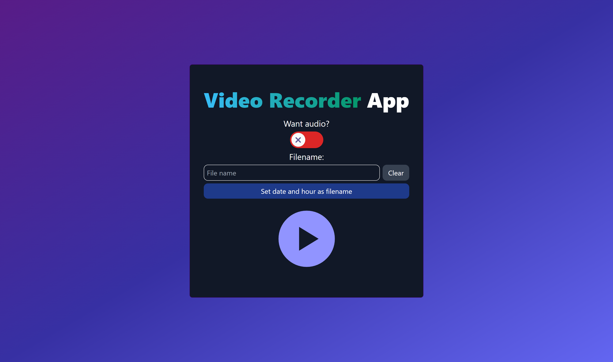

# Media Recorder App :video_camera:

This is a very simple and small application to use the MediaRecorder API of JavaScript and be able to capture video from your computer or any browser tab. You can also assign a name to the file to download. It only uses the WEBM format.

